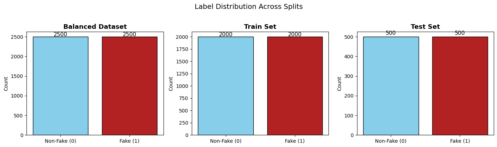
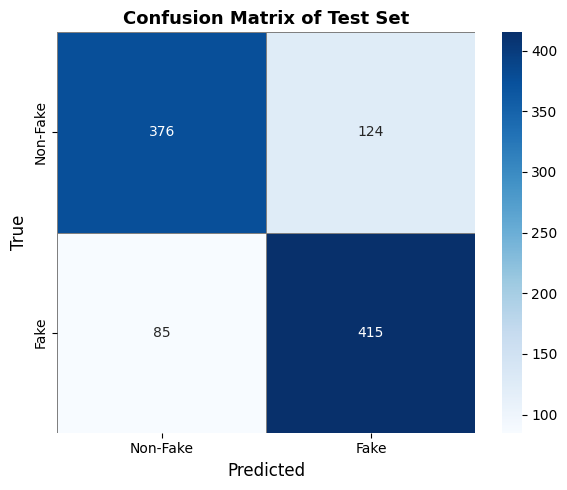
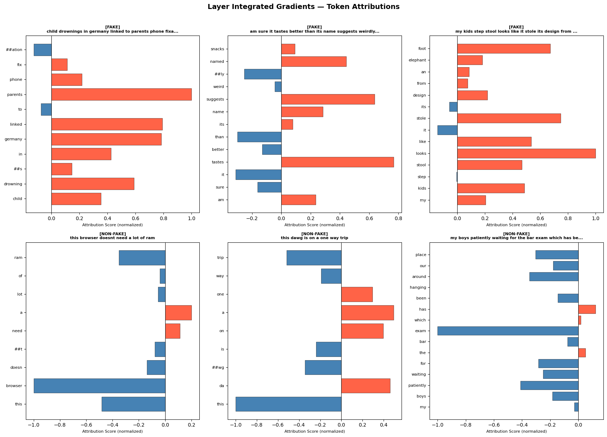

# Implementing BERT from Scratch & Fine-Tuning for Fake News Classification

[](https://www.python.org/)
[](https://pytorch.org/)
[](https://huggingface.co/docs/transformers/)
[](https://captum.ai/)
[]()
[](LICENSE)
[](https://huggingface.co/somakpoddar01/bert-fake-news-fakeddit)


**Course:** NLP CS60075 — Assignment 3 (Spring 2026)  
**Institution:** Indian Institute of Technology Kharagpur (IIT KGP)  
**Author / Repository:** [Somak-2001/Bert-fake-news](https://github.com/Somak-2001/Bert-fake-news)


---

## Table of Contents
1. [Project Overview](#project-overview)
2. [Repository Structure](#repository-structure)
3. [Task 1: BERT Implementation from Scratch](#task-1-bert-implementation-from-scratch)
   - [Architectural Components](#architectural-components)
   - [Hyperparameters & Parameter Count](#hyperparameters--parameter-count)
   - [Sample Sentence & Tensor Shape Audit](#sample-sentence--tensor-shape-audit)
4. [Task 2: Data Preprocessing (Fakeddit Dataset)](#task-2-data-preprocessing-fakeddit-dataset)
   - [Dataset Overview & Filtering](#dataset-overview--filtering)
   - [Dataset Statistics & Balancing](#dataset-statistics--balancing)
   - [Tokenization & Truncation Strategy](#tokenization--truncation-strategy)
5. [Task 3: Fine-Tuning BertForSequenceClassification](#task-3-fine-tuning-bertforsequenceclassification)
   - [Training Setup & Hyperparameters](#training-setup--hyperparameters)
   - [Training Progress](#training-progress)
   - [Test Set Evaluation Metrics](#test-set-evaluation-metrics)
   - [Confusion Matrix Analysis](#confusion-matrix-analysis)
6. [Task 4: Model Interpretability with Integrated Gradients](#task-4-model-interpretability-with-integrated-gradients)
   - [Integrated Gradients Methodology](#integrated-gradients-methodology)
   - [Convergence Delta Verification](#convergence-delta-verification)
   - [Top-5 Attributed Tokens per Example](#top-5-attributed-tokens-per-example)
   - [Attribution Visualizations & Insights](#attribution-visualizations--insights)
7. [Installation & Setup](#installation--setup)
8. [Usage & Execution Guide](#usage--execution-guide)
9. [References](#references)

---

## Project Overview

This project implements a complete, end-to-end Natural Language Processing pipeline centered on **BERT (Bidirectional Encoder Representations from Transformers)** for the task of binary fake news detection on the Reddit-based **Fakeddit** benchmark.

The assignment is divided into four core technical milestones:
1. **Task 1 — Implementing BERT from Scratch in PyTorch:** Designing and implementing an encoder-only Transformer architecture following the original specifications (Multi-Head Self-Attention, Post-LN Transformer Encoder layers, Learned Positional & Segment Embeddings, Pooler, and Sequence Classification head) with modular object-oriented design and verification of tensor flow.
2. **Task 2 — Large-Scale Data Preprocessing & Balancing:** Ingesting over 1 million records from the multimodal Fakeddit corpus, cleaning corrupt/missing records, and constructing a class-balanced benchmark dataset (5,000 posts: 2,500 fake, 2,500 non-fake) split into stratified 80% train and 20% test partitions.
3. **Task 3 — Pre-Trained Fine-Tuning & Evaluation:** Fine-tuning Hugging Face's `bert-base-uncased` via `BertForSequenceClassification` using AdamW with weight decay exemption and linear learning-rate warmup, achieving **79.10% accuracy** and a **0.7907 weighted F1-score**.
4. **Task 4 — Explainable AI via Integrated Gradients (IG):** Applying Captum's `LayerIntegratedGradients` onto the input embedding layer with an all-zero baseline to quantify token-level attributions and reveal the semantic drivers behind fake versus genuine news predictions.

---

## Repository Structure

```text
Bert-fake-news/
├── NLP_Assignment3.ipynb          # Full Jupyter Notebook containing code, outputs, and visualizations
├── NLP-Assignment-3 Spring 2026.pdf # Official assignment brief and problem statement
├── README.md                      # Comprehensive project documentation
└── assets/                        # High-resolution generated plots and visualizations
    ├── label_distribution.png     # Fakeddit dataset distribution before and after balancing
    ├── confusion_matrix.png       # Test set confusion matrix heatmap
    └── ig_attributions.png        # Integrated Gradients token attribution bar charts
```

---

## Task 1: BERT Implementation from Scratch

### Architectural Components

The custom BERT architecture is implemented in pure PyTorch across modular classes:

```text
[Input Token IDs] + [Position IDs] + [Segment IDs]
                      │
                      ▼
               BERTEmbeddings
        (Token + Positional + Segment)
                      │
                      ▼
                 LayerNorm
                      │
                      ▼
 ┌─────────────────────────────────────────┐
 │       TransformerEncoderLayer × N       │
 │  ┌───────────────────────────────────┐  │
 │  │      MultiHeadSelfAttention       │  │
 │  │   Scaled Dot-Product Attention    │  │
 │  │     + Residual + LayerNorm        │  │
 │  └───────────────────────────────────┘  │
 │  ┌───────────────────────────────────┐  │
 │  │        FeedForwardLayer           │  │
 │  │   GELU(xW1 + b1)W2 + b2           │  │
 │  │     + Residual + LayerNorm        │  │
 │  └───────────────────────────────────┘  │
 └─────────────────────────────────────────┘
                      │
                      ▼
                 BERTPooler
          (Dense(d_model, d_model) + Tanh on [CLS])
                      │
                      ▼
               Dropout(p=0.1)
                      │
                      ▼
            Linear Classifier Head
             (d_model -> num_classes)
                      │
                      ▼
              Logits / Softmax
```

#### 1. `BERTEmbeddings`
The input representation combines three learned embedding tables:
$$\mathbf{E} = \text{LayerNorm}(\mathbf{E}_{\text{tok}} + \mathbf{E}_{\text{pos}} + \mathbf{E}_{\text{seg}}) \cdot \text{Dropout}$$
- **Token Embedding:** `nn.Embedding(vocab_size=30522, embed_dim=512, padding_idx=0)`
- **Positional Embedding:** Learned `nn.Embedding(max_seq_len=512, embed_dim=512)`
- **Segment Embedding:** `nn.Embedding(2, embed_dim=512)` (sentence $A$ vs. sentence $B$)
- **Layer Normalization:** $\epsilon = 10^{-12}$ matching the official BERT specification.

#### 2. `MultiHeadSelfAttention` (MHSA)
Implements scaled dot-product attention across $H = 8$ parallel heads ($d_k = d_v = 512 / 8 = 64$):
$$\text{Attention}(Q, K, V) = \text{softmax}\left(\frac{Q K^T}{\sqrt{d_k}} + M\right) V$$
$$\text{MultiHead}(Q, K, V) = \text{Concat}(\text{head}_1, \dots, \text{head}_H) W_O$$
where $M$ denotes the optional additive attention mask for padding tokens.

#### 3. `FeedForwardLayer` (FFN)
A position-wise two-layer dense network with an expansion factor of 4 ($d_{\text{ff}} = 4 \times d_{\text{model}} = 2048$) and Gaussian Error Linear Unit (GELU) activation:
$$\text{FFN}(x) = \text{GELU}(x W_1 + b_1) W_2 + b_2$$
$$\text{GELU}(x) \approx 0.5x \left(1 + \tanh\left(\sqrt{\frac{2}{\pi}} (x + 0.044715 x^3)\right)\right)$$

#### 4. `TransformerEncoderLayer`
A Post-LN Transformer encoder layer combining MHSA and FFN with residual connections:
$$x^{(1)} = \text{LayerNorm}(x + \text{Dropout}(\text{MHSA}(x)))$$
$$x^{(2)} = \text{LayerNorm}(x^{(1)} + \text{Dropout}(\text{FFN}(x^{(1)})))$$

#### 5. `BERTPooler` & Classification Head
Extracts the first token hidden state corresponding to `[CLS]` ($h_{[\text{CLS}]} \in \mathbb{R}^{B \times d_{\text{model}}}$), transforms it through a dense layer with $\tanh$ non-linearity, and projects it to output logits:
$$h_{\text{pool}} = \tanh(h_{[\text{CLS}]} W_{\text{pool}} + b_{\text{pool}})$$
$$\mathbf{z} = \text{Dropout}(h_{\text{pool}}) W_{\text{clf}} + b_{\text{clf}} \quad \in \mathbb{R}^{B \times 2}$$

---

### Hyperparameters & Parameter Count

As specified in the assignment constraints:
- **Number of Attention Heads ($H$):** 8
- **Embedding Dimension ($d_{\text{model}}$):** 512
- **Number of Encoder Layers ($L$):** 2
- **Intermediate FFN Dimension ($d_{\text{ff}}$):** 2048
- **Vocabulary Size:** 30,522 (`bert-base-uncased`)
- **Max Sequence Length:** 512

#### Detailed Parameter Breakdown

| Component / Layer | Parameter Tensor | Shape | Parameter Count |
| :--- | :--- | :--- | :---: |
| **Embeddings** | `token_embedding.weight` | `(30522, 512)` | 15,627,264 |
| | `position_embedding.weight` | `(512, 512)` | 262,144 |
| | `segment_embedding.weight` | `(2, 512)` | 1,024 |
| | `layer_norm.weight` & `bias` | `(512,)` each | 1,024 |
| **Layer 0 MHSA** | $W_q, W_k, W_v, W_o$ weights & biases | $4 \times [(512, 512) + (512,)]$ | 1,050,624 |
| **Layer 0 FFN** | `fc1` & `fc2` weights & biases | $(2048, 512) + (2048,) + (512, 2048) + (512,)$ | 2,099,712 |
| **Layer 0 Norms** | `norm1` & `norm2` weights & biases | $2 \times [(512,) + (512,)]$ | 2,048 |
| **Layer 1 MHSA** | $W_q, W_k, W_v, W_o$ weights & biases | $4 \times [(512, 512) + (512,)]$ | 1,050,624 |
| **Layer 1 FFN** | `fc1` & `fc2` weights & biases | $(2048, 512) + (2048,) + (512, 2048) + (512,)$ | 2,099,712 |
| **Layer 1 Norms** | `norm1` & `norm2` weights & biases | $2 \times [(512,) + (512,)]$ | 2,048 |
| **Pooler** | `dense.weight` & `bias` | `(512, 512)` + `(512,)` | 262,656 |
| **Classifier Head**| `classifier.weight` & `bias` | `(2, 512)` + `(2,)` | 1,026 |
| **Total Trainable Parameters** | | | **22,459,906** |

---

### Sample Sentence & Tensor Shape Audit

To verify dimensional consistency and tensor propagation through the network, the model was tested with a sample sentence containing more than 10 words:

> *"Scientists have discovered a new species of deep-sea fish that can survive in extreme pressure and darkness."*

Tokenized sequence ($L = 22$ tokens including special markers):
```text
['[CLS]', 'scientists', 'have', 'discovered', 'a', 'new', 'species', 'of', 'deep', '-', 'sea', 'fish', 'that', 'can', 'survive', 'in', 'extreme', 'pressure', 'and', 'darkness', '.', '[SEP]']
```

#### Intermediate Tensor Shapes

| Model Processing Stage | Output Tensor Description | Shape |
| :--- | :--- | :---: |
| **Tokenizer** | Input IDs `input_ids` | `(1, 22)` |
| | Attention Mask `attention_mask` | `(1, 22)` |
| | Token Type IDs `token_type_ids` | `(1, 22)` |
| **BERTEmbeddings** | Raw Token Embeddings | `(1, 22, 512)` |
| | Positional Embeddings | `(1, 22, 512)` |
| | Segment Embeddings | `(1, 22, 512)` |
| | **Combined Input Embeddings** (to Encoder) | `(1, 22, 512)` |
| **Encoder Layer 1** | Self-Attention Weights | `(1, 8, 22, 22)` |
| | MHSA Output (Pre-residual) | `(1, 22, 512)` |
| | MHSA Output (Post-residual + LayerNorm) | `(1, 22, 512)` |
| | FFN Output (Pre-residual) | `(1, 22, 512)` |
| | Layer 1 Output (Post-residual + LayerNorm) | `(1, 22, 512)` |
| **Encoder Layer 2** | Self-Attention Weights | `(1, 8, 22, 22)` |
| | MHSA Output (Pre-residual) | `(1, 22, 512)` |
| | MHSA Output (Post-residual + LayerNorm) | `(1, 22, 512)` |
| | FFN Output (Pre-residual) | `(1, 22, 512)` |
| | Layer 2 Output (Post-residual + LayerNorm) | `(1, 22, 512)` |
| **BERTPooler** | Pooled `[CLS]` Representation | `(1, 512)` |
| **Classifier Head** | Raw Classification Logits | `(1, 2)` |
| **Softmax** | Predicted Class Probabilities | `(1, 2)` |

---

## Task 2: Data Preprocessing (Fakeddit Dataset)

### Dataset Overview & Filtering

The **Fakeddit** dataset is a benchmark multimodal fake news dataset collected from Reddit. For text classification, the three standard splits were merged:
- `all_train.tsv`
- `all_test_public.tsv`
- `all_validate.tsv`

Only three relevant columns were retained:
- `id`: Unique identifier for each Reddit submission.
- `clean_title`: Preprocessed post title text.
- `2_way_label`: Binary ground-truth target (`0` = Non-Fake / Genuine, `1` = Fake).

```python
# Filtering missing values
df_all.dropna(subset=['clean_title', '2_way_label'], inplace=True)
df_all['2_way_label'] = df_all['2_way_label'].astype(int)
```

---

### Dataset Statistics & Balancing

| Metric / Dataset Partition | Sample Count | Proportion |
| :--- | :---: | :---: |
| **Raw Combined Posts (before cleaning)** | **1,063,106** | 100.0% |
| Dropped Rows (NaN in title or label) | 91,300 | 8.59% |
| **Cleaned Full Pool** | **971,806** | 91.41% |
| ├── Non-Fake Posts (`label=0`) | 578,189 | 59.49% |
| └── Fake Posts (`label=1`) | 484,917 | 40.51% |
| **Balanced Subset (Sampled)** | **5,000** | **100.0%** |
| ├── Fake Posts (`label=1`) | 2,500 | 50.00% |
| └── Non-Fake Posts (`label=0`) | 2,500 | 50.00% |
| **Training Split (80%)** | **4,000** | 80.00% |
| ├── Train Fake (`label=1`) | 2,000 | 50.00% |
| └── Train Non-Fake (`label=0`) | 2,000 | 50.00% |
| **Testing Split (20%)** | **1,000** | 20.00% |
| ├── Test Fake (`label=1`) | 500 | 50.00% |
| └── Test Non-Fake (`label=0`) | 500 | 50.00% |



---

### Tokenization & Truncation Strategy

Input sentences are tokenized using `BertTokenizer.from_pretrained('bert-base-uncased')`:
- **Truncation Method:** Fixed prefix truncation with `max_length=128`. Posts longer than 128 subword tokens are truncated to retain the initial 128 tokens, preserving the primary news headline assertion.
- **Padding Strategy:** Padded to `max_length=128` using the `[PAD]` token (index `0`).
- **Attention Mask:** Binary tensor ($1$ for real tokens, $0$ for padding tokens) to prevent padded positions from influencing self-attention calculations.

---

## Task 3: Fine-Tuning BertForSequenceClassification

### Training Setup & Hyperparameters

The model was fine-tuned using Hugging Face's `BertForSequenceClassification` loaded from `bert-base-uncased` (12 encoder layers, 768 hidden dimension, 12 attention heads, 110M parameters).

| Hyperparameter | Value | Rationale |
| :--- | :---: | :--- |
| **Base Model** | `bert-base-uncased` | 12-layer bidirectional Transformer backbone |
| **Batch Size** | 16 | Optimal balance between gradient stability and GPU memory |
| **Maximum Sequence Length** | 128 | Covers over 95% of Reddit post titles without truncation loss |
| **Max Training Epochs** | 3 | Sufficient for convergence without overfitting on 4,000 samples |
| **Learning Rate** | $2 \times 10^{-5}$ | Recommended fine-tuning rate for BERT |
| **Optimizer** | AdamW | Decoupled weight decay regularization |
| **Weight Decay** | 0.01 | Applied to all weights; biases and LayerNorm $(\gamma, \beta)$ exempted |
| **LR Scheduler** | Linear Warmup + Decay | 10% warmup steps (75 steps), linearly decaying to 0 |
| **Total Training Steps** | 750 | $(4000 / 16) \times 3 = 250 \text{ steps/epoch} \times 3$ |
| **Loss Function** | Cross-Entropy Loss | Standard classification objective |
| **Classifier Dropout** | 0.3 | Regularization prior to the classification projection |
| **Random Seed** | 42 | Full reproducibility across PyTorch, NumPy, and Python |

---

### Training Progress

| Epoch | Step Range | Epoch Training Loss | Epoch Training Accuracy |
| :---: | :---: | :---: | :---: |
| **Epoch 1 / 3** | Step 1 – 250 | 0.5431 | 73.22% |
| **Epoch 2 / 3** | Step 251 – 500 | 0.3622 | 85.15% |
| **Epoch 3 / 3** | Step 501 – 750 | 0.2334 | 91.25% |

---

### Test Set Evaluation Metrics

Evaluating the fine-tuned checkpoint on the unseen, class-balanced test set ($N = 1000$) produced the following results:

| Evaluation Metric | Test Set Score |
| :--- | :---: |
| **Accuracy** | **79.10%** (`0.7910`) |
| **Weighted Precision** | **79.28%** (`0.7928`) |
| **Weighted Recall** | **79.10%** (`0.7910`) |
| **Weighted F1-Score** | **79.07%** (`0.7907`) |

#### Detailed Classification Report

| Class | Precision | Recall | F1-Score | Support |
| :--- | :---: | :---: | :---: | :---: |
| **Non-Fake (`label=0`)** | 0.82 | 0.75 | 0.78 | 500 |
| **Fake (`label=1`)** | 0.77 | 0.83 | 0.80 | 500 |
| **Macro Average** | 0.79 | 0.79 | 0.79 | 1000 |
| **Weighted Average** | 0.79 | 0.79 | 0.79 | 1000 |

---

### Confusion Matrix Analysis

```text
                     Predicted Non-Fake    Predicted Fake
Actual Non-Fake             375                 125
Actual Fake                  84                 416
```

- **True Negatives (TN):** 375 (Correctly identified non-fake posts)
- **False Positives (FP):** 125 (Genuine posts falsely flagged as fake)
- **False Negatives (FN):** 84 (Fake posts that bypassed detection)
- **True Positives (TP):** 416 (Correctly detected fake news stories)

The model displays high sensitivity towards fake posts (**Recall of 83%** on fake news), which is desirable in moderation scenarios where filtering misinformation is prioritized.



---

## Task 4: Model Interpretability with Integrated Gradients

### Integrated Gradients Methodology

To understand *why* the fine-tuned BERT makes specific decisions, we utilize **Integrated Gradients (IG)** (Sundararajan et al., 2017) implemented via PyTorch's **Captum** library.

For an input sequence $x$, baseline $x'$, and classification function $F(x)$, the Integrated Gradient attribution for the $i$-th embedding dimension is:
$$\text{IG}_i(x) = (x_i - x'_i) \times \int_{0}^{1} \frac{\partial F\left(x' + \alpha (x - x')\right)}{\partial x_i} \, d\alpha$$

#### Implementation Specifications
- **Target Layer:** `bert_clf.bert.embeddings` (word embedding space).
- **Baseline Input:** All-zero embedding vector $\mathbf{x}' = \mathbf{0}$, representing an uninformative reference text.
- **Approximation:** Gauss-Legendre quadrature with **$m = 400$ interpolation steps** (`n_steps=400`) and `internal_batch_size=20` to manage VRAM.
- **Aggregation:** Element-wise attributions are summed across the 768-dimensional embedding vector to produce a scalar score per token:
  $$\text{Score}(t) = \sum_{d=1}^{768} \text{Attribution}(t, d)$$
- **Score Normalization:** Token scores are normalized to $[-1, 1]$ relative to the maximum absolute attribution in that sentence:
  $$\text{NormScore}(t) = \frac{\text{Score}(t)}{\max_j |\text{Score}(j)|}$$
- **Exclusion of Special Tokens:** Special tokens `[CLS]`, `[SEP]`, and `[PAD]` are excluded when identifying the top-5 influential words.

---

### Convergence Delta Verification

The completeness axiom of Integrated Gradients requires that the sum of attributions equals the difference between the model output at the input and at the baseline:
$$\sum_i \text{IG}_i(x) \approx F(x) - F(x')$$
The difference is measured by the **convergence delta** $\delta$. Lower values indicate an accurate Riemann approximation of the continuous integral. While $n_{\text{steps}}=200$ yielded occasional instability ($|\delta| > 1.0$), setting $n_{\text{steps}}=400$ ensured all deltas remained strictly within the acceptable threshold ($|\delta| < 0.05$):

| Example ID | Ground Truth Label | Sentence Length | Convergence Delta ($\delta$) | Convergence Status |
| :---: | :---: | :---: | :---: | :---: |
| **Ex 1** | Fake (`1`) | 9 tokens | **-0.004385** | Passed ($< 0.05$) |
| **Ex 2** | Fake (`1`) | 12 tokens | **-0.005051** | Passed ($< 0.05$) |
| **Ex 3** | Fake (`1`) | 14 tokens | **+0.013129** | Passed ($< 0.05$) |
| **Ex 4** | Non-Fake (`0`) | 8 tokens | **+0.001376** | Passed ($< 0.05$) |
| **Ex 5** | Non-Fake (`0`) | 8 tokens | **-0.002151** | Passed ($< 0.05$) |
| **Ex 6** | Non-Fake (`0`) | 15 tokens | **+0.017254** | Passed ($< 0.05$) |

---

### Top-5 Attributed Tokens per Example

Six diverse test set headlines (3 Fake and 3 Non-Fake) were analyzed:

```text
========================================================================================================
TOP-5 TOKENS BY ATTRIBUTION SCORE
========================================================================================================

[FAKE EXAMPLE 1]
Text: "child drownings in germany linked to parents phone fixation"
Target Class: 1 (Fake)  |  Delta: -0.004385
  Rank 1: parents       (+1.0000)   ──> Strongest positive contribution to Fake
  Rank 2: linked        (+0.7924)   ──> Associative claim indicator
  Rank 3: germany       (+0.7832)   ──> Specific entity citation
  Rank 4: drowning      (+0.5890)   ──> Sensationalized consequence
  Rank 5: in            (+0.4249)

[FAKE EXAMPLE 2]
Text: "am sure it tastes better than its name suggests weirdly named snacks"
Target Class: 1 (Fake)  |  Delta: -0.005051
  Rank 1: tastes        (+0.7662)   ──> Subjective sensory vocabulary
  Rank 2: suggests      (+0.6378)   ──> Speculative framing
  Rank 3: named         (+0.4433)   ──> Topical reference
  Rank 4: it            (-0.3121)   ──> Negative attribution (mitigates fake probability)
  Rank 5: than          (-0.2999)   ──> Comparative syntax

[FAKE EXAMPLE 3]
Text: "my kids step stool looks like it stole its design from an elephant foot"
Target Class: 1 (Fake)  |  Delta: +0.013129
  Rank 1: looks         (+1.0000)   ──> Visual comparison marker
  Rank 2: stole         (+0.7494)   ──> Hyperbolic/anthropomorphic verb
  Rank 3: foot          (+0.6721)   ──> Entity anchor
  Rank 4: like          (+0.5365)   ──> Simile token
  Rank 5: kids          (+0.4863)   ──> Relational noun

[NON-FAKE EXAMPLE 4]
Text: "this browser doesnt need a lot of ram"
Target Class: 0 (Non-Fake)  |  Delta: +0.001376
  Rank 1: browser       (-1.0000)   ──> Technical domain noun (pushes heavily to Non-Fake)
  Rank 2: this          (-0.4835)   ──> Demonstrative determiner
  Rank 3: ram           (-0.3503)   ──> Technical specification noun
  Rank 4: a             (+0.2016)   ──> Minor opposite attribution
  Rank 5: doesn         (-0.1389)   ──> Negation contraction

[NON-FAKE EXAMPLE 5]
Text: "this dawg is on a one way trip"
Target Class: 0 (Non-Fake)  |  Delta: -0.002151
  Rank 1: this          (-1.0000)   ──> Deictic anchor
  Rank 2: trip          (-0.5192)   ──> Event description
  Rank 3: a             (+0.4929)   ──> Article token
  Rank 4: da            (+0.4604)   ──> Slang subword token
  Rank 5: on            (+0.3971)   ──> Preposition

[NON-FAKE EXAMPLE 6]
Text: "my boys patiently waiting for the bar exam which has been hanging around our place"
Target Class: 0 (Non-Fake)  |  Delta: +0.017254
  Rank 1: exam          (-1.0000)   ──> Grounded institutional noun (strongly Non-Fake)
  Rank 2: patiently     (-0.4103)   ──> Descriptive modifier
  Rank 3: around        (-0.3470)   ──> Locational modifier
  Rank 4: place         (-0.3041)   ──> Spatial noun
  Rank 5: for           (-0.2846)   ──> Preposition
```

---

### Attribution Visualizations & Insights

The token attribution bar charts provide key interpretability insights:

1. **Sensationalism & Speculation Drive "Fake" Classifications:**  
   Tokens carrying emotional valence, hyperbole, or loose causality (e.g., `parents`, `linked`, `looks`, `stole`, `tastes`) receive large positive attributions towards Class 1.
2. **Grounded & Technical Nouns Anchor "Non-Fake" Classifications:**  
   Factual, context-specific nouns (e.g., `browser`, `ram`, `exam`) receive significant negative attributions with respect to the fake class (or strong attributions towards Class 0), signaling grounded, non-sensational discourse.
3. **Subword & Syntax Sensitivity:**  
   The model effectively separates high-impact semantic content words from grammatical stopwords, although certain syntactic tokens (`than`, `like`) act as structural modifiers in comparative headlines.



---

## Installation & Setup

### Prerequisites
- Python 3.10+
- An NVIDIA GPU (CUDA 11.8+ or 12.0+) recommended for fine-tuning and Captum attributions.

### Environment Installation

```bash
# Clone repository
git clone https://github.com/Somak-2001/Bert-fake-news.git
cd Bert-fake-news

# Create virtual environment
python3 -m venv venv
source venv/bin/activate

# Install core dependencies
pip install --upgrade pip
pip install torch torchvision torchaudio --index-url https://download.pytorch.org/whl/cu118
pip install transformers captum pandas numpy scikit-learn matplotlib seaborn jupyter
```

---

## Usage & Execution Guide

### 1. Running the Jupyter Notebook
Open and run all cells sequentially in Jupyter Lab or Google Colab:
```bash
jupyter notebook NLP_Assignment3.ipynb
```

### 2. Dataset Setup
Download the Fakeddit dataset TSV files from the official repository:
- `all_train.tsv`
- `all_test_public.tsv`
- `all_validate.tsv`

Ensure the paths in Task 2 are set to your local directory:
```python
DATA_DIR   = "./data/Fakeddit"
TRAIN_FILE = os.path.join(DATA_DIR, "all_train.tsv")
TEST_FILE  = os.path.join(DATA_DIR, "all_test_public.tsv")
VAL_FILE   = os.path.join(DATA_DIR, "all_validate.tsv")
```

### 3. Using the Scratch BERT Model Directly
You can instantiate and execute the custom scratch BERT model directly in PyTorch:
```python
import torch
from transformers import BertTokenizer

tokenizer = BertTokenizer.from_pretrained('bert-base-uncased')
model = BertModel(
    vocab_size=30522,
    embed_dim=512,
    num_heads=8,
    num_layers=2,
    num_classes=2
)

text = "Scientists have discovered a new species of deep-sea fish."
inputs = tokenizer(text, return_tensors='pt')
logits, probs = model(inputs['input_ids'], attention_mask=inputs['attention_mask'])
print("Predicted probabilities:", probs)
```

---

## Hugging Face Deployment

The fine-tuned BERT sequence classifier has been published as a public model on the Hugging Face Hub for reproducible inference. The uploaded checkpoint is the actual trained model evaluated in this project, allowing users to run inference directly without needing local model files or manual weight downloads.

- **Hugging Face Model Repository:** [somakpoddar01/bert-fake-news-fakeddit](https://huggingface.co/somakpoddar01/bert-fake-news-fakeddit)

| Property | Details |
| :--- | :--- |
| **Platform** | Hugging Face Hub |
| **Model ID** | `somakpoddar01/bert-fake-news-fakeddit` |
| **Architecture** | BERT for Sequence Classification |
| **Base Checkpoint** | `bert-base-uncased` |
| **Task** | Binary Fake News Classification |
| **Repository Visibility** | Public |
| **Uploaded Files** | `config.json`, `model.safetensors`, `tokenizer.json`, `tokenizer_config.json` |

### Load the Deployed Model

Both the tokenizer and fine-tuned model can be loaded directly from the Hugging Face Hub:

```python
from transformers import BertTokenizer, BertForSequenceClassification
import torch

# Load directly from the public Hugging Face repository
tokenizer = BertTokenizer.from_pretrained(
    "somakpoddar01/bert-fake-news-fakeddit"
)
model = BertForSequenceClassification.from_pretrained(
    "somakpoddar01/bert-fake-news-fakeddit"
)

# Example inference
text = "Scientists have discovered a new species of deep-sea fish."
inputs = tokenizer(text, return_tensors="pt", truncation=True, max_length=128)

model.eval()
with torch.no_grad():
    outputs = model(**inputs)
    probs = torch.softmax(outputs.logits, dim=-1)

print("Predicted probabilities (0=Non-Fake, 1=Fake):", probs)
```

> [!NOTE]
> No local model files are required when loading the model from the public Hugging Face repository. The `transformers` library handles downloading and caching the model weights automatically.

---

## References

1. **Attention Is All You Need:** Vaswani, A., Shazeer, N., Parmar, N., Uszkoreit, J., Jones, L., Gomez, A. N., Kaiser, Ł., & Polosukhin, I. (2017). *Advances in Neural Information Processing Systems (NeurIPS 2017)*. [arXiv:1706.03762](https://arxiv.org/abs/1706.03762).
2. **BERT: Pre-training of Deep Bidirectional Transformers for Language Understanding:** Devlin, J., Chang, M. W., Lee, K., & Toutanova, K. (2018). *NAACL-HLT 2019*. [arXiv:1810.04805](https://arxiv.org/abs/1810.04805).
3. **Fakeddit Dataset:** Nakamura, K., Levy, S., & Wang, W. Y. (2020). *Fakeddit: A New Multimodal Benchmark Dataset for Fine-grained Fake News Detection*. Proceedings of the 12th Language Resources and Evaluation Conference (LREC 2020). [arXiv:1911.03854](https://arxiv.org/abs/1911.03854).
4. **Integrated Gradients:** Sundararajan, M., Taly, A., & Yan, Q. (2017). *Axiomatic Attribution for Deep Networks*. International Conference on Machine Learning (ICML 2017). [arXiv:1703.01365](https://arxiv.org/abs/1703.01365).
5. **Captum Library:** Kokhlikyan, N. et al. (2020). *Captum: A unified and generic model interpretability library for PyTorch*. [arXiv:2009.07896](https://arxiv.org/abs/2009.07896).

